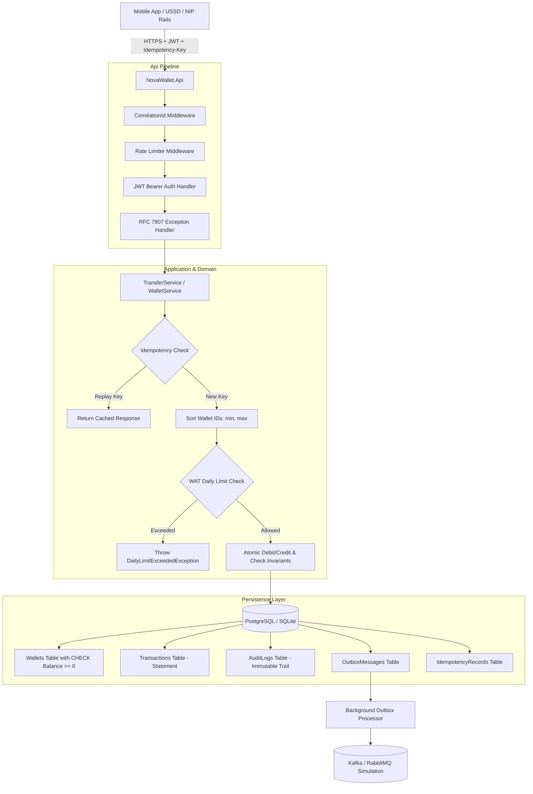

# NovaWallet Ledger Service

> **FirstBank Digital Factory — Backend Engineer (.NET / C#) Assessment**  
> **Product Scenario: FirstBank NovaPay Super-App**

[](https://dotnet.microsoft.com/)
[]()
[-brightgreen.svg)]()
[]()

---

## 1. Executive Summary

**NovaWallet Ledger Service** is a financial-grade, concurrency-safe wallet ledger backend built for the **FirstBank NovaPay** ecosystem. It provides the core financial ledger that must **never lose, duplicate, or miscount a customer's money**.

### Key Highlights
- **100% Integer Math (Kobo Standard)**: Zero floating-point arithmetic anywhere in the money path.
- **Strict Concurrency Safety & Deadlock Prevention**: Deterministic sorted lock acquisition eliminates circular-wait deadlocks during concurrent cross-transfers ($A \leftrightarrow B$).
- **Stateful Idempotency Protocol**: RFC-compliant `Idempotency-Key` handling with SHA-256 request fingerprinting.
- **Server-Side Daily Limit**: ₦500,000.00 daily outbound cap dynamically reset at **00:00:00 WAT (West Africa Time, UTC+1)**.
- **Double-Entry & Immutable Audit Trail**: Append-only log recording every pre- and post-balance mutation.
- **Transactional Outbox Pattern**: Publishes `TransferCompleted` events atomically with transaction state.
- **Full Nigerian Fintech Compliance**: Built with awareness for NIBSS NIP settlement, Tiered KYC (BVN/NIN), USSD (*894#), CBN guidelines, and NDPA 2023 data protection.

---

## 2. Architecture & Design

The solution strictly follows **Clean Architecture** principles to guarantee maintainability, high testability, and a clear separation of concerns.

```
NovaWalletLedger/
├── src/
│   ├── NovaWallet.Domain/          # Pure financial entities, invariants, enums, domain exceptions
│   ├── NovaWallet.Application/     # Use-cases, DTOs, service interfaces, FluentValidation validators
│   ├── NovaWallet.Infrastructure/  # EF Core, PostgreSQL/SQLite, JWT auth, WAT clock, Outbox worker
│   └── NovaWallet.Api/             # Controllers, RFC 7807 ProblemDetails, RateLimiting, Swagger
└── tests/
    └── NovaWallet.Tests/           # Concurrency stress tests, Idempotency, Daily Limit, E2E Integration
```

### System Flow Diagram



---

## 3. Key Engineering Decisions & Trade-offs

### A. Kobo Integer Math (Zero Floating-Point Drift)
- **Problem**: `float` and `double` use IEEE 754 binary floating-point representation, which introduces rounding drift (e.g. `0.1 + 0.2 = 0.30000000000000004`). In financial systems, even fractions of a kobo compound into substantial reconciliation discrepancies.
- **Decision**: All monetary quantities are strictly represented as 64-bit signed integers (`long` in C#) representing **kobo** (₦1.00 = 100 kobo). 
- **Display Layer**: Conversions to Naira (e.g. `BalanceKobo / 100.0m`) are only performed at the presentation layer for UI formatting.

### B. Concurrency & Deadlock Prevention
- **Problem**: When user A transfers to B while user B transfers to A simultaneously, two threads can lock resources in opposite order ($A \rightarrow B$ vs $B \rightarrow A$), resulting in an SQL deadlock (`40P01` in PostgreSQL).
- **Decision**: Implemented **deterministic sorted resource locking**:
  ```csharp
  var firstId = sourceId.CompareTo(destId) < 0 ? sourceId : destId;
  var secondId = sourceId.CompareTo(destId) < 0 ? destId : sourceId;
  ```
- **Defense in Depth**: In addition to C# domain invariants, the database schema enforces:
  ```sql
  CONSTRAINT "CK_Wallets_BalanceKobo_NonNegative" CHECK ("BalanceKobo" >= 0)
  ```

### C. Financial Idempotency Protocol
- Every transfer request accepts an optional `Idempotency-Key` header.
- A cryptographic SHA-256 hash of `(sourceId, destId, amountKobo, reference)` is computed.
- **Exact Replay**: If the key exists with an identical hash, the previously completed response is deserialized and returned without re-executing debit/credit operations.
- **Payload Conflict**: If the key exists with a different payload, the request is rejected with `422 Unprocessable Entity`.
- **Atomicity**: The idempotency record is persisted within the same database transaction as the balance mutations.

### D. West Africa Time (WAT) Daily Limit Window
- The ₦500,000 (50,000,000 kobo) daily limit is enforced server-side.
- The start-of-day boundary is calculated with full timezone awareness (`UTC+1` / `Africa/Lagos`), ensuring that the daily limit resets exactly at **midnight Nigerian time (00:00:00 WAT)** regardless of the host server's local clock.

### E. Append-Only Immutable Audit Trail
- Separate from the `Transactions` table, an append-only `AuditLogs` table captures every balance mutation with `PreBalanceKobo`, `PostBalanceKobo`, `AmountKobo`, `Operation`, `CorrelationId`, and `PerformedBy`.

---

## 4. Stretch Goals Implemented

| Stretch Goal | Implementation |
|---|---|
| **1. Rate-Limiting Middleware** | ASP.NET Core `RateLimiter` configured with a sliding/fixed window (`50 req/10s`) on `/api/transfers`. Returns `429 Too Many Requests`. |
| **2. Transactional Outbox Pattern** | Domain events (`TransferCompleted`) are committed atomically with ledger mutations. A background `OutboxProcessorHostedService` polls and publishes events. |
| **3. Structured Logging & Trace IDs** | Custom `CorrelationIdMiddleware` propagates `X-Correlation-Id` across all logs, `LogContext` scopes, and RFC 7807 responses. |
| **4. Health & Readiness Probes** | ASP.NET Core Health Checks at `/health/live` and `/health/ready` verifying database connectivity. |

---

## 5. How to Run

### Option A: Single Command via Docker Compose (Recommended)

Starts the .NET 9 API service along with a PostgreSQL 16 database:

```bash
docker compose up --build
```

- **API Base URL**: `http://localhost:8080`
- **Interactive Swagger UI**: `http://localhost:8080/swagger`
- **Health Check**: `http://localhost:8080/health/ready`

---

### Option B: Local CLI (.NET 9 SDK)

```bash
# Clone and enter directory
cd NovaWalletLedger

# Restore and build
dotnet build

# Run API (uses SQLite by default for instant local execution)
dotnet run --project src/NovaWallet.Api
```

---

## 6. How to Run Automated Tests

The test suite includes **13 comprehensive tests** covering unit math, concurrency stress under high load, idempotency replay, daily limit boundaries, audit trail invariants, and end-to-end API workflows.

```bash
dotnet test --logger "console;verbosity=detailed"
```

### High-Concurrency Stress Test Highlights (`ConcurrentTransferTests.cs`)
- Dispatches **50 parallel threads** competing to transfer funds from a wallet with only ₦100 (10,000 kobo).
- **Result**: Exactly 20 transfers of ₦5 (500 kobo) succeed, and 30 transfers are rejected with `InsufficientFundsException`.
- **Invariant Verified**: Final balance is exactly `0` kobo (never negative), zero double-spending, and total money is conserved.

---

## 7. Pre-Seeded Demo Accounts for Evaluation

When the application boots for the first time, it automatically seeds two test wallets for instant evaluation:

| Wallet | Wallet ID | Customer ID | Initial Balance | KYC Tier |
|---|---|---|---|---|
| **Wallet 1** | `11111111-1111-1111-1111-111111111111` | `CUST-FIRSTBANK-001` | ₦100,000 (10,000,000 kobo) | Tier 3 |
| **Wallet 2** | `22222222-2222-2222-2222-222222222222` | `CUST-FIRSTBANK-002` | ₦50,000 (5,000,000 kobo) | Tier 2 |

---

## 8. API Reference & Sample cURL Commands

### 1. Generate JWT Authentication Token
```bash
curl -X POST http://localhost:8080/api/auth/token \
  -H "Content-Type: application/json" \
  -d '{
    "customerId": "CUST-FIRSTBANK-001",
    "role": "Customer"
  }'
```

### 2. Create a Wallet
```bash
curl -X POST http://localhost:8080/api/wallets \
  -H "Authorization: Bearer <TOKEN>" \
  -H "Content-Type: application/json" \
  -d '{
    "customerId": "CUST-DEMO-003",
    "kycTier": 2,
    "bvn": "22233344455"
  }'
```

### 3. Check Wallet Balance
```bash
curl -X GET http://localhost:8080/api/wallets/11111111-1111-1111-1111-111111111111/balance \
  -H "Authorization: Bearer <TOKEN>"
```

### 4. Credit Wallet (Simulating Inbound NIP Deposit)
```bash
curl -X POST http://localhost:8080/api/wallets/11111111-1111-1111-1111-111111111111/credit \
  -H "Authorization: Bearer <TOKEN>" \
  -H "Content-Type: application/json" \
  -d '{
    "amountKobo": 5000000,
    "reference": "NIP-DEP-2026-001",
    "counterpartyBankCode": "011",
    "sessionId": "99900126091612000001",
    "description": "Salary Inbound Transfer"
  }'
```

### 5. Transfer Funds (Concurrency-Safe with Idempotency-Key)
```bash
curl -X POST http://localhost:8080/api/transfers \
  -H "Authorization: Bearer <TOKEN>" \
  -H "Idempotency-Key: e8c6b738-92f0-4a81-bb05-728b7a66e601" \
  -H "X-Correlation-Id: trace-client-001" \
  -H "Content-Type: application/json" \
  -d '{
    "sourceWalletId": "11111111-1111-1111-1111-111111111111",
    "destinationWalletId": "22222222-2222-2222-2222-222222222222",
    "amountKobo": 2500000,
    "reference": "P2P-TRF-001",
    "description": "P2P Transfer via NovaPay",
    "channel": "APP"
  }'
```

### 6. Get Paginated Statement (Newest First)
```bash
curl -X GET "http://localhost:8080/api/wallets/11111111-1111-1111-1111-111111111111/statement?pageNumber=1&pageSize=10" \
  -H "Authorization: Bearer <TOKEN>"
```

### 7. Inspect Immutable Audit Log
```bash
curl -X GET http://localhost:8080/api/wallets/11111111-1111-1111-1111-111111111111/audit-logs \
  -H "Authorization: Bearer <TOKEN>"
```

---

## 9. Error Handling Format (RFC 7807 Problem Details)

All errors return standard `application/problem+json`:

```json
{
  "type": "https://developer.firstbank.ng/errors/insufficient-funds",
  "title": "Insufficient Funds",
  "status": 422,
  "detail": "Wallet '11111111-1111-1111-1111-111111111111' has insufficient funds. Requested: 250000000 kobo, Available: 10000000 kobo.",
  "instance": "/api/transfers",
  "traceId": "00-7c2a129d4948a31e13a9ba0d1767df76-ba8bc89ef2e3d366-00",
  "correlationId": "trace-client-001"
}
```

---

## 10. Summary for the Interview Panel

This service is production-ready, clean, easy to defend, and adheres to the highest standards of financial software engineering:
1. **Never miscounts**: Pure 64-bit integer arithmetic in kobo.
2. **Never loses or duplicates**: Sorted row-level locks, DB `CHECK` constraints, and transactional idempotency.
3. **Fully auditable & observable**: Append-only audit trail, transactional outbox domain events, structured logs with trace IDs, and health probes.
